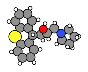
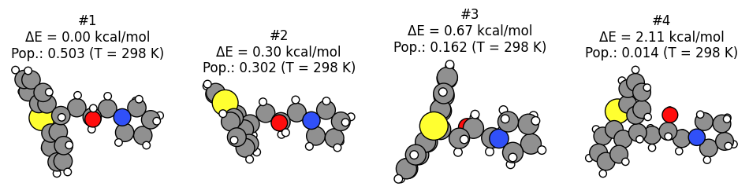
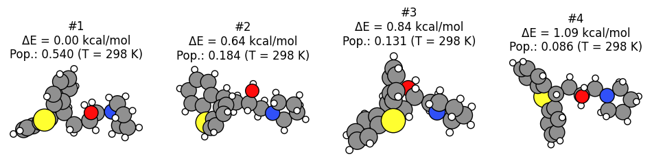
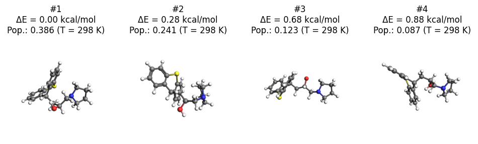
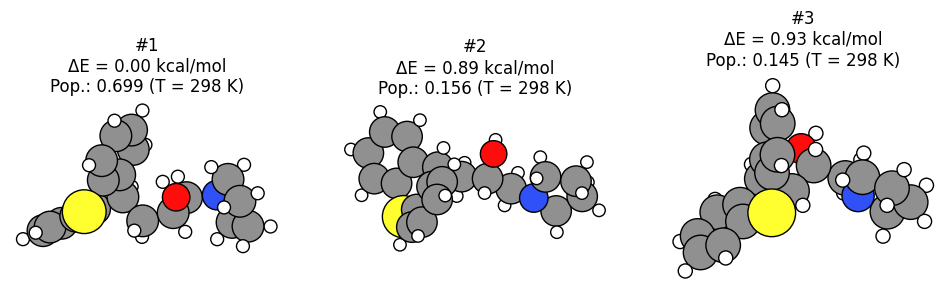

Worked Example
--------------

Initial imports
~~~~~~~~~~~~~~~

.. code:: ipython3

   import os
   import sys

   import matplotlib.pyplot as plt
   import numpy as np

   from scm.plams import ConformersJob
   from scm.plams import *

   # this line is not required in AMS2025+
   init();

::

   PLAMS working folder: /path/plams/examples/ConformersGeneration/plams_workdir.002

Initial structure
~~~~~~~~~~~~~~~~~

.. code:: ipython3

   molecule = from_smiles("OC(CC1c2ccccc2Sc2ccccc21)CN1CCCC1")
   plot_molecule(molecule);

Generate conformers with RDKit and UFF
~~~~~~~~~~~~~~~~~~~~~~~~~~~~~~~~~~~~~~

The fastest way to generate conformers is to use RDKit with the UFF force field.

Below we specify to generate 16 initial conformers. The final number of conformers may be smaller, as the geometry optimization may cause several structures to enter the same minimum.

Conformer generation settings
~~~~~~~~~~~~~~~~~~~~~~~~~~~~~

.. code:: ipython3

   s = Settings()
   s.input.ams.Task = "Generate"  # default
   s.input.ams.Generator.Method = "RDKit"  # default
   s.input.ams.Generator.RDKit.InitialNConformers = 16  # optional, non-default
   s.input.ForceField.Type = "UFF"  # default

Conformer generation input file
~~~~~~~~~~~~~~~~~~~~~~~~~~~~~~~

.. code:: ipython3

   print(ConformersJob(settings=s).get_input())

::

   Generator
     Method RDKit
     RDKit
       InitialNConformers 16
     End
   End

   Task Generate

   Engine ForceField
     Type UFF
   EndEngine

Run conformer generation
~~~~~~~~~~~~~~~~~~~~~~~~

.. code:: ipython3

   generate_job = ConformersJob(name="generate", molecule=molecule, settings=s)
   generate_job.run();

::

   [12.09|16:10:47] JOB generate STARTED
   [12.09|16:10:47] JOB generate RUNNING
   [12.09|16:10:51] JOB generate FINISHED
   [12.09|16:10:51] JOB generate SUCCESSFUL

Conformer generation results
~~~~~~~~~~~~~~~~~~~~~~~~~~~~

Some helper functions
~~~~~~~~~~~~~~~~~~~~~

.. code:: ipython3

   def get_energies(job: ConformersJob, temperature=298, unit="kcal/mol"):
       return job.results.get_relative_energies(unit)

   def get_populations(job: ConformersJob, temperature=298, unit="kcal/mol"):
       return job.results.get_boltzmann_distribution(temperature)

   def get_energy_header(unit="kcal/mol"):
       return f"ΔE [{unit}]"

   def get_population_header(temperature=298):
       return f"Pop. (T = {temperature} K)"

   def get_conformers(job: ConformersJob):
       return job.results.get_conformers()

.. code:: ipython3

   try:
       # For AMS2025+ can use JobAnalysis class to perform results analysis
       from scm.plams import JobAnalysis

       def print_results(job: ConformersJob, temperature=298, unit="kcal/mol"):
           ja = (
               JobAnalysis(standard_fields=None)
               .add_job(job)
               .add_field(
                   "Id",
                   lambda j: list(range(1, len(get_conformers(j)) + 1)),
                   display_name="Conformer Id",
                   expansion_depth=1,
               )
               .add_field("Energies", get_energies, display_name=get_energy_header(), expansion_depth=1, fmt=".2f")
               .add_field(
                   "Populations", get_populations, display_name=get_population_header(), expansion_depth=1, fmt=".3f"
               )
           )

           # Pretty-print if running in a notebook
           if "ipykernel" in sys.modules:
               ja.display_table()
           else:
               print(ja.to_table())

   except ImportError:

       def print_results(job: ConformersJob, temperature=298, unit="kcal/mol"):
           energies = get_energies(job, temperature, unit)
           populations = get_populations(job, temperature, unit)

           print(f"Total # conformers in set: {len(energies)}")
           dE_header = get_energy_header(unit)
           pop_header = get_population_header(temperature)
           print(f'{"#":>4s} {dE_header:>14s} {pop_header:>18s}')

           for i, (E, pop) in enumerate(zip(energies, populations)):
               print(f"{i+1:4d} {E:14.2f} {pop:18.3f}")

Actual results
~~~~~~~~~~~~~~

Below we see that the **conformer generation gave 14 distinct conformers**, where the highest-energy conformer is 18 kcal/mol higher in energy than the lowest energy conformer.

You can also see the **relative populations** of these conformers at the specified temperature. The populations are calculated from the **Boltzmann distribution** and the relative energies.

.. code:: ipython3

   unit = "kcal/mol"
   temperature = 298

.. code:: ipython3

   print_results(generate_job, temperature, unit)

============ ============= ================
Conformer Id ΔE [kcal/mol] Pop. (T = 298 K)
============ ============= ================
1            0.00          0.503
2            0.30          0.302
3            0.67          0.162
4            2.11          0.014
5            2.12          0.014
6            2.89          0.004
7            3.84          0.001
8            6.71          0.000
9            13.42         0.000
10           14.07         0.000
11           15.25         0.000
12           15.79         0.000
13           15.83         0.000
14           17.77         0.000
15           18.79         0.000
16           23.98         0.000
============ ============= ================

.. code:: ipython3

   generate_job.results.plot_conformers(4, temperature=temperature, unit=unit, lowest=True);

Re-optimize conformers with GFNFF
~~~~~~~~~~~~~~~~~~~~~~~~~~~~~~~~~

The UFF force field is not very accurate for geometries and energies. From an initial conformer set you can reoptimize it with a better level of theory.

The **Optimize** task performs **GeometryOptimization** jobs on each conformer in a set.

Below, the most stable conformers (within 8 kcal/mol of the most stable conformer) at the UFF level of theory are re-optimized with GFNFF, which gives more accurate geometries.

.. code:: ipython3

   s = Settings()
   s.input.ams.Task = "Optimize"
   s.input.ams.InputConformersSet = os.path.abspath(generate_job.results.rkfpath())  # must be absolute path
   s.input.ams.InputMaxEnergy = 8.0  # only conformers within 8 kcal/mol at the PREVIOUS level of theory
   s.input.GFNFF  # or choose a different engine if you don't have a GFNFF license

   reoptimize_job = ConformersJob(settings=s, name="reoptimize")
   print(reoptimize_job.get_input())

::

   InputConformersSet /path/plams/examples/ConformersGeneration/plams_workdir.002/generate/conformers.rkf

   InputMaxEnergy 8.0

   Task Optimize

   Engine GFNFF
   EndEngine

.. code:: ipython3

   reoptimize_job.run();

::

   [12.09|16:11:00] JOB reoptimize STARTED
   [12.09|16:11:00] JOB reoptimize RUNNING
   [12.09|16:11:02] JOB reoptimize FINISHED
   [12.09|16:11:02] JOB reoptimize SUCCESSFUL

.. code:: ipython3

   print_results(reoptimize_job, temperature=temperature, unit=unit)

============ ============= ================
Conformer Id ΔE [kcal/mol] Pop. (T = 298 K)
============ ============= ================
1            0.00          0.540
2            0.64          0.184
3            0.84          0.131
4            1.09          0.086
5            1.82          0.025
6            1.90          0.022
7            2.25          0.012
============ ============= ================

.. code:: ipython3

   reoptimize_job.results.plot_conformers(4, temperature=temperature, unit=unit, lowest=True);

Score conformers with DFTB
~~~~~~~~~~~~~~~~~~~~~~~~~~

If you have many conformers or a very large molecule, it can be computationally expensive to do the conformer generation or reoptimization and a high level of theory.

The **Score** task runs **SinglePoint** jobs on the conformers in a set. This lets you use a more computationally expensive method. Here, we choose DFTB, although normally you may choose some DFT method.

.. code:: ipython3

   s = Settings()
   s.input.ams.Task = "Score"
   s.input.ams.InputConformersSet = os.path.abspath(reoptimize_job.results.rkfpath())  # must be absolute path
   s.input.ams.InputMaxEnergy = 4.0  # only conformers within 4 kcal/mol at the PREVIOUS level of theory
   s.input.DFTB.Model = "GFN1-xTB"  # or choose a different engine if you don't have a DFTB license
   # s.input.adf.XC.GGA = 'PBE'                       # to use ADF PBE
   # s.input.adf.XC.DISPERSION = 'GRIMME3 BJDAMP'     # to use ADF PBE with Grimme D3(BJ) dispersion

   score_job = ConformersJob(settings=s, name="score")
   score_job.run();

::

   [12.09|16:11:09] JOB score STARTED
   [12.09|16:11:09] JOB score RUNNING
   [12.09|16:11:10] JOB score FINISHED
   [12.09|16:11:10] JOB score SUCCESSFUL

.. code:: ipython3

   print_results(score_job, temperature=temperature, unit=unit)

============ ============= ================
Conformer Id ΔE [kcal/mol] Pop. (T = 298 K)
============ ============= ================
1            0.00          0.654
2            0.89          0.146
3            0.93          0.136
4            1.70          0.037
5            2.12          0.018
6            2.60          0.008
7            4.01          0.001
============ ============= ================

.. code:: ipython3

   score_job.results.plot_conformers(4, temperature=temperature, unit=unit, lowest=True);

Here, you see that from the conformers in the set, **DFTB predicts a different lowest-energy conformer than GFNFF** (compare to previous figure).

Filter a conformer set
~~~~~~~~~~~~~~~~~~~~~~

In practice, you may have generated thousands of conformers for a particular structure. Many of those conformers may be so high in energy that their Boltzmann weights are very small.

The **Filter** task only filters the conformers, it does not perform any additional calculations. It can be used to reduce a conformer set so that it is more convenient to work with.

Below, we filter the conformers set to only the conformers within 1 kcal/mol of the minimum.

.. code:: ipython3

   s = Settings()
   s.input.ams.Task = "Filter"
   s.input.ams.InputConformersSet = os.path.abspath(score_job.results.rkfpath())
   s.input.ams.InputMaxEnergy = 1.0

   filter_job = ConformersJob(settings=s, name="filter")
   filter_job.run();

::

   [12.09|16:11:15] JOB filter STARTED
   [12.09|16:11:15] JOB filter RUNNING
   [12.09|16:11:15] JOB filter FINISHED
   [12.09|16:11:15] JOB filter SUCCESSFUL

.. code:: ipython3

   print_results(filter_job, temperature=temperature, unit=unit)

============ ============= ================
Conformer Id ΔE [kcal/mol] Pop. (T = 298 K)
============ ============= ================
1            0.00          0.699
2            0.89          0.156
3            0.93          0.145
============ ============= ================

.. code:: ipython3

   filter_job.results.plot_conformers(4, temperature=temperature, unit=unit, lowest=True);

The structures and energies are identical to before. However, the relative populations changed slightly as there are now fewer conformers in the set.

More about conformers
~~~~~~~~~~~~~~~~~~~~~

-  Try **CREST** instead of RDKit to generate the initial conformer set

-  The **Expand** task can be used to expand a set of conformers.
