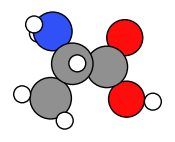
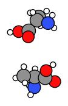
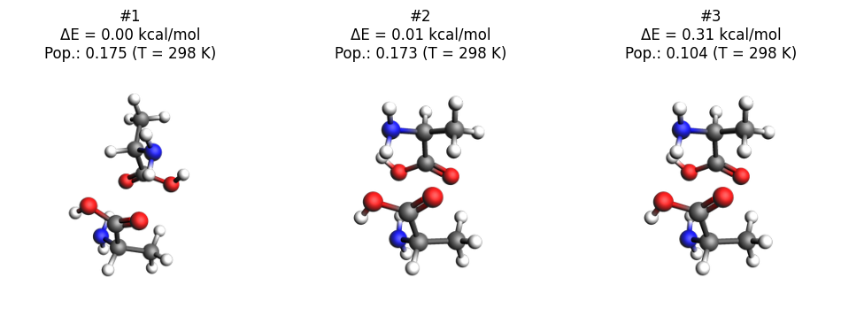

Worked Example
--------------

Lets see how two alanine molecules orient themselves using CREST conformer generation. To do this we will constrain the system in a spherical region using the ``SphericalWall`` constraint. We start by setting up a system of two alanine molecules in a relatively small space.

Initial imports
~~~~~~~~~~~~~~~

.. code:: ipython3

   import scm.plams as plams
   import sys
   from scm.plams import ConformersJob
   import numpy as np
   import matplotlib.pyplot as plt
   import os

   try:
       from scm.plams import view  # view molecule using AMSview in a Jupyter Notebook in AMS2026+

       _has_view = True
   except ImportError:
       from scm.plams import plot_molecule  # plot molecule in a Jupyter Notebook in AMS2023+

       _has_view = False

       def view(molecule, ax=None, **kwargs):
           plot_molecule(molecule, ax=ax)

   # this line is not required in AMS2025+
   plams.init();

::

   PLAMS working folder: /path/plams/examples/ConformersMultipleMolecules/plams_workdir.003

Single alanine molecule
~~~~~~~~~~~~~~~~~~~~~~~

.. code:: ipython3

   smiles = "CC(N)C(=O)O"
   alanine = plams.from_smiles(smiles)
   view(alanine, height=300, width=300)

Initial system: alanine dimer
~~~~~~~~~~~~~~~~~~~~~~~~~~~~~

Pack two alanine molecules in a sphere with a density of 0.5 kg/L.

.. code:: ipython3

   density = 0.5
   mol = plams.packmol(alanine, n_molecules=2, density=density, sphere=True)

Translate the molecule to be centered around the origin (needed for SphericalWall later):

.. code:: ipython3

   mol.translate(-np.array(mol.get_center_of_mass()))

.. code:: ipython3

   view(mol, direction="along_pca3")

Calculation setup
~~~~~~~~~~~~~~~~~

To determine the radius of the ``SphericalWall`` we measure the size of the initial dimer.

.. code:: ipython3

   dists = plams.distance_array(mol, mol)
   max_dist = np.max(dists)
   diameter = 1.33 * max_dist
   radius = diameter / 2
   print(f"Largest distance between atoms: {max_dist:.3f} ang.")
   print(f"Radius: {radius:.3f} ang.")

::

   Largest distance between atoms: 9.909 ang.
   Radius: 6.589 ang.

Now we can set up the Crest conformer generation job, with the appropriate spherical wall constraining the molecules close together.

.. code:: ipython3

   settings = plams.Settings()
   settings.input.ams.EngineAddons.WallPotential.Enabled = "Yes"
   settings.input.ams.EngineAddons.WallPotential.Radius = radius
   settings.input.ams.Generator.Method = "CREST"
   settings.input.ams.Output.KeepWorkDir = "Yes"
   settings.input.ams.GeometryOptimization.MaxConvergenceTime = "High"
   settings.input.ams.Generator.CREST.NCycles = 3  # at most 3 CREST cycles for this demo
   settings.input.GFNFF = plams.Settings()

Run the conformers job
~~~~~~~~~~~~~~~~~~~~~~

Now we can run the conformer generation job.

.. code:: ipython3

   job = ConformersJob(molecule=mol, settings=settings)
   job.run()
   # ConformersJob.load_external("plams_workdir/conformers/conformers.rkf")  # load from disk instead of running the job

::

   [12.09|16:12:17] JOB conformers STARTED
   [12.09|16:12:17] JOB conformers RUNNING
   [12.09|16:16:13] JOB conformers FINISHED
   [12.09|16:16:14] JOB conformers SUCCESSFUL

   <scm.plams.interfaces.adfsuite.conformers.ConformersResults at 0x7a0c23f46ac0>

.. code:: ipython3

   rkf = job.results.rkfpath()
   print(f"Conformers stored in {rkf}")

::

   Conformers stored in /path/plams/examples/ConformersMultipleMolecules/plams_workdir.003/conformers/conformers.rkf

This job will run for approximately 15 minutes.

Results
~~~~~~~

Here we plot the three lowest-energy conformers.

.. code:: ipython3

   job.results.plot_conformers();

       if isinstance(indices, int):
           N_plot = min(indices, len(energies))
           if lowest:
               indices = list(range(N_plot))
           else:
               indices = np.linspace(0, len(energies) - 1, N_plot, dtype=np.int32)
       if indices is None:
           indices = list(range(min(3, len(energies))))

       fig, axes = plt.subplots(1, len(indices), figsize=(12, 4))
       if len(indices) == 1:
           axes = [axes]

       for ax, i in zip(axes, indices):
           mol = molecules[i]
           E = energies[i]
           population = populations[i]

           if _has_view:
               img = view(mol, width=300, height=300)
               ax.imshow(img)
               ax.axis("off")
               ax.set_title(f"#{i+1}\nΔE = {E:.2f} kcal/mol\nPop.: {population:.3f} (T = {temperature} K)")
           else:
               view(mol, ax=ax)
               ax.set_title(f"#{i+1}\nΔE = {E:.2f} kcal/mol\nPop.: {population:.3f} (T = {temperature} K)")

.. code:: ipython3

   plot_conformers(job)

You can also open the conformers in AMSmovie to browse all conformers 1000+ conformers:

.. code:: ipython3

   !amsmovie {rkf}

Finally in AMS2025+, you can also inspect the conformer data using the JobAnalysis tool.

.. code:: ipython3

   try:
       from scm.plams import JobAnalysis

       ja = (
           JobAnalysis(standard_fields=None)
           .add_job(job)
           .add_field(
               "Id",
               lambda j: list(range(1, len(j.results.get_conformers()) + 1)),
               display_name="Conformer Id",
               expansion_depth=1,
           )
           .add_field(
               "Energies",
               lambda j: j.results.get_relative_energies("kcal/mol"),
               display_name="E",
               expansion_depth=1,
               fmt=".2f",
           )
           .add_field(
               "Populations",
               lambda j: j.results.get_boltzmann_distribution(298),
               display_name="P",
               expansion_depth=1,
               fmt=".3f",
           )
       )

       # Pretty-print if running in a notebook
       if "ipykernel" in sys.modules:
           ja.display_table(max_rows=20)
       else:
           print(ja.to_table())

   except ImportError:
       pass

============ ======= =====
Conformer Id E       P
============ ======= =====
1            0.00    0.077
2            0.01    0.076
3            0.01    0.076
4            0.07    0.069
5            0.10    0.065
6            0.15    0.059
7            0.21    0.054
8            0.23    0.052
9            0.31    0.046
10           0.32    0.045
…            …       …
940          931.03  0.000
941          954.43  0.000
942          998.90  0.000
943          1195.50 0.000
944          1226.73 0.000
945          1256.35 0.000
946          1273.11 0.000
947          1285.97 0.000
948          1307.95 0.000
949          1311.18 0.000
============ ======= =====
