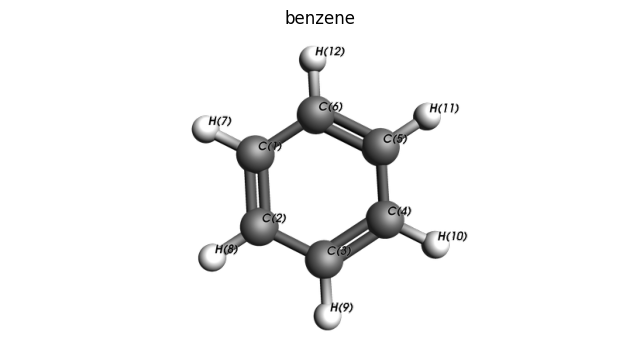
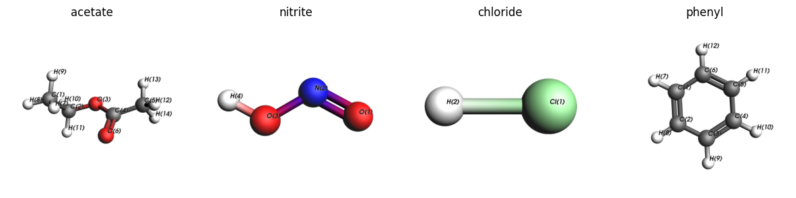
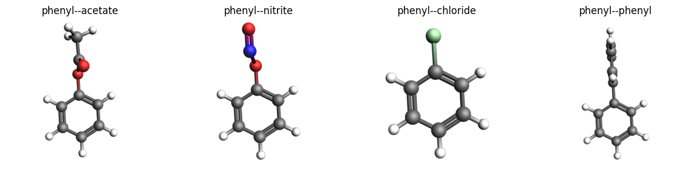
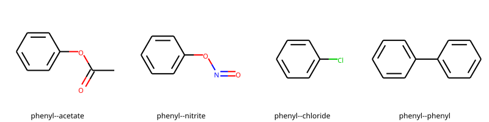

Worked Example
--------------

Initial imports
~~~~~~~~~~~~~~~

.. code:: ipython3

   import scm.plams as plams
   import matplotlib.pyplot as plt
   from rdkit import Chem
   from rdkit.Chem import Draw
   from rdkit.Chem.Draw import IPythonConsole
   from rdkit.Chem import AllChem
   from typing import List, Tuple

   IPythonConsole.ipython_useSVG = True
   IPythonConsole.molSize = 250, 250

   # this line is not required in AMS2025+
   plams.init()

::

   PLAMS working folder: /path/plams/examples/MoleculeSubstitution/plams_workdir

Helper class and function
~~~~~~~~~~~~~~~~~~~~~~~~~

The ``MoleculeConnector`` class and ``substitute()`` method below are convenient to use.

.. code:: ipython3

   class MoleculeConnector:
       def __init__(self, molecule, connector, name="molecule"):
           self.name = name
           self.molecule = molecule
           self.molecule.properties.name = name
           self.connector = connector  # 2-tuple of integers, unlike the Molecule.substitute() method which uses two atoms

       def __str__(self):
           return f"""
   Name: {self.name}
   {self.molecule}
   Connector: {self.connector}. This means that when substitution is performed atom {self.connector[0]} will be kept in the substituted molecule. Atom {self.connector[1]}, and anything connected to it, will NOT be kept.
           """

   def substitute(substrate: MoleculeConnector, ligand: MoleculeConnector):
       """
       Returns: Molecule with the ligand added to the substrate, replacing the respective connector bonds.
       """
       molecule = substrate.molecule.copy()
       molecule.substitute(
           connector=(molecule[substrate.connector[0]], molecule[substrate.connector[1]]),
           ligand=ligand.molecule,
           ligand_connector=(ligand.molecule[ligand.connector[0]], ligand.molecule[ligand.connector[1]]),
       )
       return molecule

   def set_atom_indices(rdmol: Chem.rdchem.Mol, start=0):
       for atom in rdmol.GetAtoms():
           atom.SetAtomMapNum(atom.GetIdx() + start)  # give 1-based index
       return rdmol

   def to_lewis(molecule: plams.Molecule, template=None, regenerate: bool = True):
       if isinstance(molecule, Chem.rdchem.Mol):
           rdmol = molecule
       else:
           rdmol = plams.to_rdmol(molecule)
       if regenerate:
           rdmol = Chem.RemoveHs(rdmol)
           smiles = Chem.MolToSmiles(rdmol)
           rdmol = Chem.MolFromSmiles(smiles)
       if template is not None:
           AllChem.GenerateDepictionMatching2DStructure(rdmol, template)
       try:
           if molecule.properties.name:
               rdmol.SetProp("_Name", molecule.properties.name)
       except AttributeError:
           pass
       return rdmol

   def smiles2template(smiles: str):
       template = Chem.MolFromSmiles(smiles)
       AllChem.Compute2DCoords(template)
       return template

   def draw_lewis_grid(
       molecules: List[plams.Molecule],
       molsPerRow: int = 4,
       template_smiles: str = None,
       regenerate: bool = False,
       draw_atom_indices: bool = False,
       draw_legend: bool = True,
   ):
       template = None
       if template_smiles:
           template = smiles2template(template_smiles)

       rdmols = [to_lewis(x, template=template, regenerate=regenerate) for x in molecules]
       if draw_atom_indices:
           for rdmol in rdmols:
               set_atom_indices(rdmol, start=1)
       legends = None
       if draw_legend:
           try:
               legends = [x.properties.name or f"mol{i}" for i, x in enumerate(molecules)]
           except AttributeError:
               pass

       return Draw.MolsToGridImage(rdmols, molsPerRow=molsPerRow, legends=legends)

   def view_molecules(molecules: List[plams.Molecule], titles: List[str], figsize: Tuple[int], **kwargs):
       fig, axes = plt.subplots(1, len(molecules), figsize=figsize)
       if len(molecules) == 1:
           axes = [axes]
       try:
           from scm.plams import view  # view molecule using AMSview in a Jupyter Notebook in AMS2026+

           imgs = [view(m, **kwargs) for m in molecules]
           for ax, img, title in zip(axes, imgs, titles):
               ax.imshow(img)
               ax.axis("off")
               ax.set_title(title)
           plt.show()
       except ImportError:
           from scm.plams import plot_molecule  # plot molecule in a Jupyter Notebook in AMS2023+

           for ax, mol, title in zip(axes, molecules, titles):
               plot_molecule(mol, ax=ax)
               ax.set_title(title)

   def view_molecule(molecule: plams.Molecule, title: str, figsize: Tuple[int] = (8, 8), **kwargs):
       view_molecules([molecule], [title], figsize, **kwargs)

Generate substrate molecule
~~~~~~~~~~~~~~~~~~~~~~~~~~~

.. code:: ipython3

   substrate_smiles = "c1ccccc1"
   substrate = plams.from_smiles(substrate_smiles, forcefield="uff")
   substrate.properties.name = "benzene"

Find out which bond to cleave
~~~~~~~~~~~~~~~~~~~~~~~~~~~~~

In the molecule you need to define which bond to cleave. To find out the bonds, run for example:

.. code:: ipython3

   for b in substrate.bonds:
       el1 = b.atom1.symbol
       el2 = b.atom2.symbol
       idx1, idx2 = substrate.index(b)
       print(f"{el1}({idx1})--{el2}({idx2})")

::

   C(1)--C(2)
   C(2)--C(3)
   C(3)--C(4)
   C(4)--C(5)
   C(5)--C(6)
   C(6)--C(1)
   C(1)--H(7)
   C(2)--H(8)
   C(3)--H(9)
   C(4)--H(10)
   C(5)--H(11)
   C(6)--H(12)

to find that atoms 6 (C) and 12 (H) are bonded. We will choose this bond to cleave.

Alternatively, we can inspect the molecule inside a Jupyter notebook, visualizing with AMSView, to also find that atoms 6 (C) and 12 (H) are bonded.

.. code:: ipython3

   view_molecule(substrate, substrate.properties.name, padding=-0.5, show_atom_labels=True, atom_label_type="Name")

.. code:: ipython3

   substrate_connector = MoleculeConnector(
       substrate, (6, 12), "phenyl"
   )  # benzene becomes phenyl when bond between atoms 6,12 is cleaved

Define ligands
~~~~~~~~~~~~~~

Perform the same steps for the ligands.

**Note**: The ligands below have an extra hydrogen or even more atoms compared to the name that they’re given.

.. code:: ipython3

   ligands = [
       MoleculeConnector(
           plams.from_smiles("CCOC(=O)C", forcefield="uff"), (3, 2), "acetate"
       ),  # ethyl acetate, bond from O to C cleaved
       MoleculeConnector(
           plams.from_smiles("O=NO", forcefield="uff"), (3, 4), "nitrite"
       ),  # nitrous acid, bond from O to H cleaved
       MoleculeConnector(
           plams.from_smiles("Cl", forcefield="uff"), (1, 2), "chloride"
       ),  # hydrogen chloride, bond from Cl to H cleaved
       MoleculeConnector(
           plams.from_smiles("c1ccccc1", forcefield="uff"), (6, 12), "phenyl"
       ),  # benzene, bond to C to H cleaved
   ]

   ligand_molecules = [ligand.molecule for ligand in ligands]

   view_molecules(
       ligand_molecules,
       [ligand.name for ligand in ligands],
       figsize=(15, 4),
       width=400,
       show_atom_labels=True,
       atom_label_type="Name",
   )

Above we see that cleaving the bonds from O(3)-C(2), O(3)-H(4), Cl(1)-H(2), and C(6)-H(12) will give the acetate, nitrite, chloride, and phenyl substituents, respectively.

Generate substituted molecules
~~~~~~~~~~~~~~~~~~~~~~~~~~~~~~

.. code:: ipython3

   mols = []

   for ligand in ligands:
       mol = substitute(substrate_connector, ligand)
       mol.properties.name = f"{substrate_connector.name}--{ligand.name}"
       mols.append(mol)
       print(f"Writing {mol.properties.name}.xyz")
       mol.write(f"{mol.properties.name}.xyz")
       print(f"{mol.properties.name} formula: {mol.get_formula(as_dict=True)}")

::

   Writing phenyl--acetate.xyz
   phenyl--acetate formula: {'C': 8, 'H': 8, 'O': 2}
   Writing phenyl--nitrite.xyz
   phenyl--nitrite formula: {'C': 6, 'H': 5, 'O': 2, 'N': 1}
   Writing phenyl--chloride.xyz
   phenyl--chloride formula: {'C': 6, 'H': 5, 'Cl': 1}
   Writing phenyl--phenyl.xyz
   phenyl--phenyl formula: {'C': 12, 'H': 10}

Plot 3D structures with PLAMS
~~~~~~~~~~~~~~~~~~~~~~~~~~~~~

.. code:: ipython3

   view_molecules(mols, [mol.properties.name for mol in mols], figsize=(15, 4), width=400, padding=-0.3)

Plot 2D Lewis structures with RDKit
~~~~~~~~~~~~~~~~~~~~~~~~~~~~~~~~~~~

The molecules can be aligned by using a benzene template. The ``regenerate`` option regenerates the molecule with RDkit to clean up the atomic positions.

.. code:: ipython3

   draw_lewis_grid(mols, template_smiles=substrate_smiles, regenerate=True)

