Worked Example
--------------

Initial imports
~~~~~~~~~~~~~~~

.. code:: ipython3

   from scm.plams import from_smiles, Molecule
   from scm.plams.interfaces.molecule.packmol import packmol
   from ase.visualize.plot import plot_atoms
   from ase.build import fcc111, bulk
   import matplotlib.pyplot as plt
   from scm.version import release
   import sys

   AMS2025 = release >= "2024.201"
   AMS2026 = release >= "2025.201"
   if AMS2025:
       from scm.plams import packmol_around
   if AMS2026:
       from scm.plams import view as plams_view
   else:
       from scm.plams import plot_molecule

Helper functions
~~~~~~~~~~~~~~~~

.. code:: ipython3

   def printsummary(mol, details=None):
       if details:
           density = details["density"]
       else:
           density = mol.get_density() * 1e-3
       s = f"{len(mol)} atoms, density = {density:.3f} g/cm^3"
       if mol.lattice:
           s += f", box = {mol.lattice[0][0]:.3f}, {mol.lattice[1][1]:.3f}, {mol.lattice[2][2]:.3f}"
       s += f", formula = {mol.get_formula()}"
       if details:
           s += f'\n#added molecules per species: {details["n_molecules"]}, mole fractions: {details["mole_fractions"]}'
       print(s)

   def view(
       mol,
       width=400,
       height=400,
       show_lattice_vectors=False,
       direction=None,
       padding=-1,
       fixed_atom_size=True,
       show_regions=False,
       show_atom_labels=False,
       lattice_as_basis=False,
   ):
       if AMS2026:
           img = plams_view(
               mol,
               width=width,
               height=height,
               padding=padding,
               direction=direction if direction else ("along_z" if not mol.lattice else "tilt_z"),
               fixed_atom_size=fixed_atom_size,
               show_lattice_vectors=show_lattice_vectors,
               show_regions=show_regions,
               show_atom_labels=show_atom_labels,
               lattice_as_basis=lattice_as_basis,
           )

           # Display in matplotlib if not running in notebook
           if "ipykernel" not in sys.modules:
               import numpy as np

               img = img.convert("RGBA")
               plt.imshow(np.array(img))
               plt.axis("off")
               plt.show()
           else:
               return img
       else:
           return plot_molecule(mol)

Liquid water (fluid with 1 component)
~~~~~~~~~~~~~~~~~~~~~~~~~~~~~~~~~~~~~

First, create the gasphase molecule:

.. code:: ipython3

   water = from_smiles("O")
   view(water, width=400, height=200, padding=0)

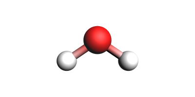

.. code:: ipython3

   print("pure liquid from approximate number of atoms and exact density (in g/cm^3), cubic box with auto-determined size")
   out = packmol(water, n_atoms=194, density=1.0)
   printsummary(out)
   out.write("water-1.xyz")
   view(out)

::

   pure liquid from approximate number of atoms and exact density (in g/cm^3), cubic box with auto-determined size
   195 atoms, density = 1.000 g/cm^3, box = 12.482, 12.482, 12.482, formula = H130O65

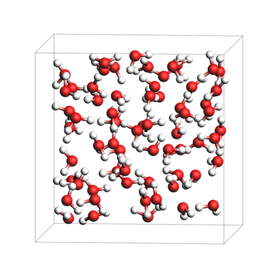

.. code:: ipython3

   print("pure liquid from approximate density (in g/cm^3) and an orthorhombic box")
   out = packmol(water, density=1.0, box_bounds=[0.0, 0.0, 0.0, 8.0, 12.0, 14.0])
   printsummary(out)
   out.write("water-2.xyz")
   view(out, show_lattice_vectors=True)

::

   pure liquid from approximate density (in g/cm^3) and an orthorhombic box
   135 atoms, density = 1.002 g/cm^3, box = 8.000, 12.000, 14.000, formula = H90O45

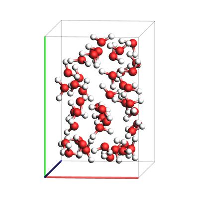

.. code:: ipython3

   print("pure liquid with explicit number of molecules and exact density")
   out = packmol(water, n_molecules=64, density=1.0)
   printsummary(out)
   out.write("water-3.xyz")
   view(out)

::

   pure liquid with explicit number of molecules and exact density
   192 atoms, density = 1.000 g/cm^3, box = 12.417, 12.417, 12.417, formula = H128O64

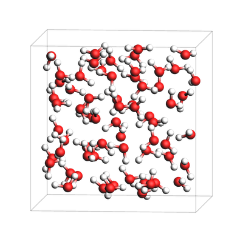

.. code:: ipython3

   print("pure liquid with explicit number of molecules and box")
   out = packmol(water, n_molecules=64, box_bounds=[0.0, 0.0, 0.0, 12.0, 13.0, 14.0])
   printsummary(out)
   out.write("water-4.xyz")
   view(out)

::

   pure liquid with explicit number of molecules and box
   192 atoms, density = 0.877 g/cm^3, box = 12.000, 13.000, 14.000, formula = H128O64

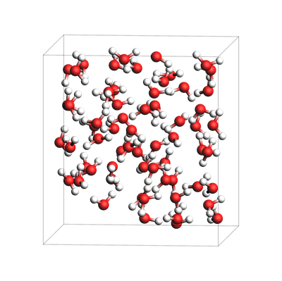

.. code:: ipython3

   if AMS2025:
       print("water-5.xyz: pure liquid in non-orthorhombic box (requires AMS2025 or later)")
       print("NOTE: Non-orthorhombic boxes may yield inaccurate results, always carefully check the output")
       # You can pack inside any lattice using the packmol_around function
       box = Molecule()
       box.lattice = [[10.0, 2.0, -1.0], [-5.0, 8.0, 0.0], [0.0, -2.0, 11.0]]
       out = packmol_around(box, molecules=[water], n_molecules=[32])
       out.write("water-5.xyz")
       img = view(out, show_lattice_vectors=True, lattice_as_basis=True, direction="corner_z")
       img_x = view(out, show_lattice_vectors=True, padding=-2, lattice_as_basis=True, direction="along_x")
       img_y = view(out, show_lattice_vectors=True, padding=-2, lattice_as_basis=True, direction="along_y")
       img_z = view(out, show_lattice_vectors=True, padding=-2, lattice_as_basis=True, direction="along_z")
   else:
       img = None
       img_x = None
       img_y = None
       img_z = None
   img

::

   water-5.xyz: pure liquid in non-orthorhombic box (requires AMS2025 or later)
   NOTE: Non-orthorhombic boxes may yield inaccurate results, always carefully check the output

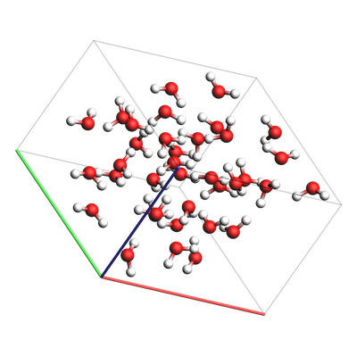

.. code:: ipython3

   fig, axes = plt.subplots(1, 3, figsize=(12, 4))
   axes[0].imshow(img_x)
   axes[0].axis("off")

   axes[1].imshow(img_y)
   axes[1].axis("off")

   axes[2].imshow(img_z)
   axes[2].axis("off")

   plt.tight_layout()

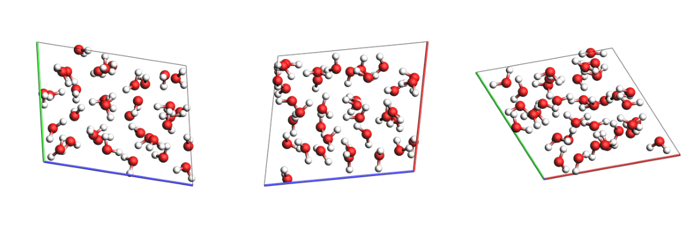

.. code:: ipython3

   if AMS2025:
       print("Experimental feature (AMS2025): guess density for pure liquid")
       print("Note: This density is meant to be equilibrated with NPT MD. It can be very inaccurate!")
       out = packmol(water, n_atoms=100)
       print(f"Guessed density: {out.get_density():.2f} kg/m^3")
       img = view(out)
   else:
       img = None
   img

::

   Experimental feature (AMS2025): guess density for pure liquid
   Note: This density is meant to be equilibrated with NPT MD. It can be very inaccurate!
   Guessed density: 1013.97 kg/m^3

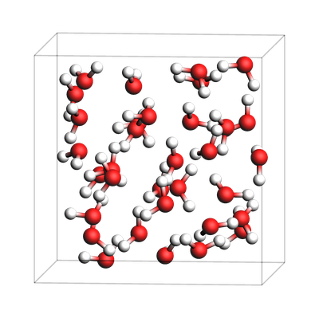

Water-acetonitrile mixture (fluid with 2 or more components)
~~~~~~~~~~~~~~~~~~~~~~~~~~~~~~~~~~~~~~~~~~~~~~~~~~~~~~~~~~~~

Let’s also create a single acetonitrile molecule:

.. code:: ipython3

   acetonitrile = from_smiles("CC#N")
   view(acetonitrile, width=300, height=300, padding=0)

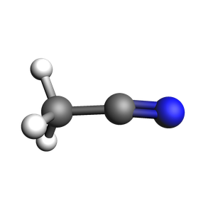

Set the desired mole fractions and density. Here, the density is calculated as the weighted average of water (1.0 g/cm^3) and acetonitrile (0.76 g/cm^3) densities, but you could use any other density.

.. code:: ipython3

   # MIXTURES
   x_water = 0.666  # mole fraction
   x_acetonitrile = 1 - x_water  # mole fraction
   # weighted average of pure component densities
   density = (x_water * 1.0 + x_acetonitrile * 0.76) / (x_water + x_acetonitrile)

   print("MIXTURES")
   print(f"x_water = {x_water:.3f}")
   print(f"x_acetonitrile = {x_acetonitrile:.3f}")
   print(f"target density = {density:.3f} g/cm^3")

::

   MIXTURES
   x_water = 0.666
   x_acetonitrile = 0.334
   target density = 0.920 g/cm^3

By setting ``return_details=True``, you can get information about the mole fractions of the returned system. They may not exactly match the mole fractions you put in.

.. code:: ipython3

   print(
       "2-1 water-acetonitrile from approximate number of atoms and exact density (in g/cm^3), "
       "cubic box with auto-determined size"
   )
   out, details = packmol(
       molecules=[water, acetonitrile],
       mole_fractions=[x_water, x_acetonitrile],
       n_atoms=200,
       density=density,
       return_details=True,
   )
   printsummary(out, details)
   out.write("water-acetonitrile-1.xyz")
   view(out)

::

   2-1 water-acetonitrile from approximate number of atoms and exact density (in g/cm^3), cubic box with auto-determined size
   201 atoms, density = 0.920 g/cm^3, box = 13.263, 13.263, 13.263, formula = C34H117N17O33
   #added molecules per species: [33, 17], mole fractions: [0.66, 0.34]

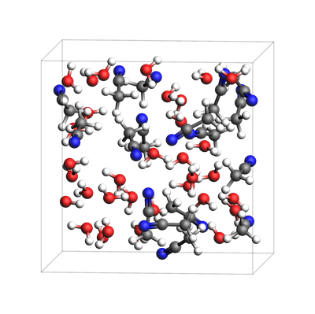

The ``details`` is a dictionary as follows:

.. code:: ipython3

   for k, v in details.items():
       print(f"{k}: {v}")

::

   n_molecules: [33, 17]
   mole_fractions: [0.66, 0.34]
   n_atoms: 201
   molecule_type_indices: [0, 0, 0, 0, 0, 0, 0, 0, 0, 0, 0, 0, 0, 0, 0, 0, 0, 0, 0, 0, 0, 0, 0, 0, 0, 0, 0, 0, 0, 0, 0, 0, 0, 0, 0, 0, 0, 0, 0, 0, 0, 0, 0, 0, 0, 0, 0, 0, 0, 0, 0, 0, 0, 0, 0, 0, 0, 0, 0, 0, 0, 0, 0, 0, 0, 0, 0, 0, 0, 0, 0, 0, 0, 0, 0, 0, 0, 0, 0, 0, 0, 0, 0, 0, 0, 0, 0, 0, 0, 0, 0, 0, 0, 0, 0, 0, 0, 0, 0, 1, 1, 1, 1, 1, 1, 1, 1, 1, 1, 1, 1, 1, 1, 1, 1, 1, 1, 1, 1, 1, 1, 1, 1, 1, 1, 1, 1, 1, 1, 1, 1, 1, 1, 1, 1, 1, 1, 1, 1, 1, 1, 1, 1, 1, 1, 1, 1, 1, 1, 1, 1, 1, 1, 1, 1, 1, 1, 1, 1, 1, 1, 1, 1, 1, 1, 1, 1, 1, 1, 1, 1, 1, 1, 1, 1, 1, 1, 1, 1, 1, 1, 1, 1, 1, 1, 1, 1, 1, 1, 1, 1, 1, 1, 1, 1, 1, 1, 1, 1, 1, 1]
   molecule_indices: [0, 0, 0, 1, 1, 1, 2, 2, 2, 3, 3, 3, 4, 4, 4, 5, 5, 5, 6, 6, 6, 7, 7, 7, 8, 8, 8, 9, 9, 9, 10, 10, 10, 11, 11, 11, 12, 12, 12, 13, 13, 13, 14, 14, 14, 15, 15, 15, 16, 16, 16, 17, 17, 17, 18, 18, 18, 19, 19, 19, 20, 20, 20, 21, 21, 21, 22, 22, 22, 23, 23, 23, 24, 24, 24, 25, 25, 25, 26, 26, 26, 27, 27, 27, 28, 28, 28, 29, 29, 29, 30, 30, 30, 31, 31, 31, 32, 32, 32, 33, 33, 33, 33, 33, 33, 34, 34, 34, 34, 34, 34, 35, 35, 35, 35, 35, 35, 36, 36, 36, 36, 36, 36, 37, 37, 37, 37, 37, 37, 38, 38, 38, 38, 38, 38, 39, 39, 39, 39, 39, 39, 40, 40, 40, 40, 40, 40, 41, 41, 41, 41, 41, 41, 42, 42, 42, 42, 42, 42, 43, 43, 43, 43, 43, 43, 44, 44, 44, 44, 44, 44, 45, 45, 45, 45, 45, 45, 46, 46, 46, 46, 46, 46, 47, 47, 47, 47, 47, 47, 48, 48, 48, 48, 48, 48, 49, 49, 49, 49, 49, 49]
   atom_indices_in_molecule: [0, 1, 2, 0, 1, 2, 0, 1, 2, 0, 1, 2, 0, 1, 2, 0, 1, 2, 0, 1, 2, 0, 1, 2, 0, 1, 2, 0, 1, 2, 0, 1, 2, 0, 1, 2, 0, 1, 2, 0, 1, 2, 0, 1, 2, 0, 1, 2, 0, 1, 2, 0, 1, 2, 0, 1, 2, 0, 1, 2, 0, 1, 2, 0, 1, 2, 0, 1, 2, 0, 1, 2, 0, 1, 2, 0, 1, 2, 0, 1, 2, 0, 1, 2, 0, 1, 2, 0, 1, 2, 0, 1, 2, 0, 1, 2, 0, 1, 2, 0, 1, 2, 3, 4, 5, 0, 1, 2, 3, 4, 5, 0, 1, 2, 3, 4, 5, 0, 1, 2, 3, 4, 5, 0, 1, 2, 3, 4, 5, 0, 1, 2, 3, 4, 5, 0, 1, 2, 3, 4, 5, 0, 1, 2, 3, 4, 5, 0, 1, 2, 3, 4, 5, 0, 1, 2, 3, 4, 5, 0, 1, 2, 3, 4, 5, 0, 1, 2, 3, 4, 5, 0, 1, 2, 3, 4, 5, 0, 1, 2, 3, 4, 5, 0, 1, 2, 3, 4, 5, 0, 1, 2, 3, 4, 5, 0, 1, 2, 3, 4, 5]
   volume: 2333.0853879652004
   density: 0.9198400000000004

.. code:: ipython3

   print("2-1 water-acetonitrile from approximate density (in g/cm^3) and box bounds")
   out, details = packmol(
       molecules=[water, acetonitrile],
       mole_fractions=[x_water, x_acetonitrile],
       box_bounds=[0, 0, 0, 13.2, 13.2, 13.2],
       density=density,
       return_details=True,
   )
   printsummary(out, details)
   out.write("water-acetonitrile-2.xyz")
   view(out)

::

   2-1 water-acetonitrile from approximate density (in g/cm^3) and box bounds
   201 atoms, density = 0.933 g/cm^3, box = 13.200, 13.200, 13.200, formula = C34H117N17O33
   #added molecules per species: [33, 17], mole fractions: [0.66, 0.34]

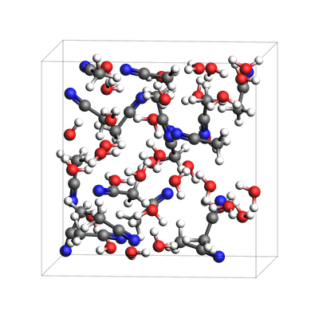

.. code:: ipython3

   print("2-1 water-acetonitrile from explicit number of molecules and density, cubic box with auto-determined size")
   out, details = packmol(
       molecules=[water, acetonitrile],
       n_molecules=[32, 16],
       density=density,
       return_details=True,
   )
   printsummary(out, details)
   out.write("water-acetonitrile-3.xyz")
   view(out)

::

   2-1 water-acetonitrile from explicit number of molecules and density, cubic box with auto-determined size
   192 atoms, density = 0.920 g/cm^3, box = 13.058, 13.058, 13.058, formula = C32H112N16O32
   #added molecules per species: [32, 16], mole fractions: [0.6666666666666666, 0.3333333333333333]

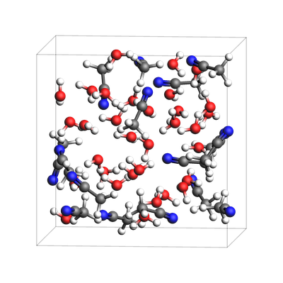

.. code:: ipython3

   print("2-1 water-acetonitrile from explicit number of molecules and box")
   out = packmol(
       molecules=[water, acetonitrile],
       n_molecules=[32, 16],
       box_bounds=[0, 0, 0, 13.2, 13.2, 13.2],
   )
   printsummary(out)
   out.write("water-acetonitrile-4.xyz")
   view(out)

::

   2-1 water-acetonitrile from explicit number of molecules and box
   192 atoms, density = 0.890 g/cm^3, box = 13.200, 13.200, 13.200, formula = C32H112N16O32

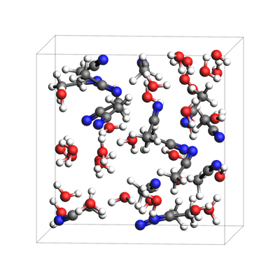

.. code:: ipython3

   if AMS2025:
       print("Experimental feature (AMS2025): guess density for mixture")
       print("Note: This density is meant to be equilibrated with NPT MD. It can be very inaccurate!")
       out = packmol([water, acetonitrile], mole_fractions=[x_water, x_acetonitrile], n_atoms=100)
       print(f"Guessed density: {out.get_density():.2f} kg/m^3")
       img = view(out)
   else:
       img = None
   img

::

   Experimental feature (AMS2025): guess density for mixture
   Note: This density is meant to be equilibrated with NPT MD. It can be very inaccurate!
   Guessed density: 849.35 kg/m^3

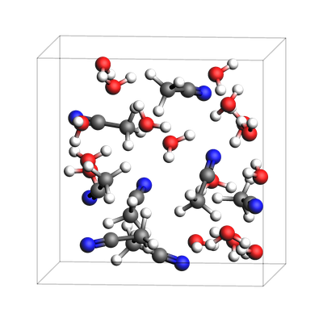

NaCl solution (solvent with 1 or more solutes)
~~~~~~~~~~~~~~~~~~~~~~~~~~~~~~~~~~~~~~~~~~~~~~

.. code:: ipython3

   sodium = from_smiles("[Na+]")
   chloride = from_smiles("[Cl-]")

For dilute solutions, it can be useful to specify the number of solute species, and fill up the rest of the box with solvent.

The required number of solvent molecules are then added to fill up the box to the target overall density or number of atoms.

This feature can be used if exactly **one** of the elements of the ``n_molecules`` list is None.

.. code:: ipython3

   if AMS2026:
       print(
           "NaCl solution from approximate density (in g/cm^3) and box bounds, and auto-determined number of solvent molecules"
       )
       out = packmol([sodium, chloride, water], n_molecules=[5, 5, None], density=1.029, box_bounds=[0, 0, 0, 19, 19, 19])
       printsummary(out)
       out.write("sodium-chloride-solution-1.xyz")
       img = view(out, fixed_atom_size=False)
   else:
       img = None
   img

::

   NaCl solution from approximate density (in g/cm^3) and box bounds, and auto-determined number of solvent molecules
   670 atoms, density = 1.030 g/cm^3, box = 19.000, 19.000, 19.000, formula = Cl5H440Na5O220

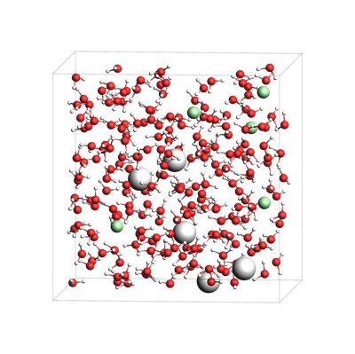

Specify the total number of atoms instead of box bounds, and auto-determine a cubic box:

.. code:: ipython3

   if AMS2026:
       print("NaCl solution from approximate number of atoms and density:")
       out = packmol([sodium, chloride, water], n_molecules=[5, 5, None], density=1.029, n_atoms=500)
       printsummary(out)
       out.write("sodium-chloride-solution-2.xyz")
       img = view(out, fixed_atom_size=False)
   else:
       img = None
   img

::

   NaCl solution from approximate number of atoms and density:
   499 atoms, density = 1.029 g/cm^3, box = 17.336, 17.336, 17.336, formula = Cl5H326Na5O163

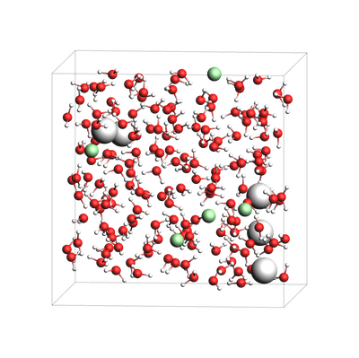

Specify the total number of atoms instead of the density (less useful option):

.. code:: ipython3

   if AMS2026:
       print("NaCl solution from approximate number of atoms and box_bounds:")
       out = packmol([sodium, chloride, water], n_molecules=[5, 5, None], n_atoms=500, box_bounds=[0, 0, 0, 12, 18, 24])
       printsummary(out)
       out.write("sodium-chloride-solution-3.xyz")
       img = view(out, fixed_atom_size=False)
   else:
       img = None
   img

::

   NaCl solution from approximate number of atoms and box_bounds:
   499 atoms, density = 1.034 g/cm^3, box = 12.000, 18.000, 24.000, formula = Cl5H326Na5O163

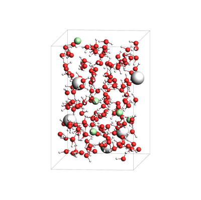

Pack inside sphere
~~~~~~~~~~~~~~~~~~

Set ``sphere=True`` to pack in a sphere (non-periodic) instead of in a periodic box. The sphere will be centered near the origin.

.. code:: ipython3

   print("water in a sphere from exact density and number of molecules")
   out, details = packmol(molecules=[water], n_molecules=[100], density=1.0, return_details=True, sphere=True)
   printsummary(out, details)
   print(f"Radius  of sphere: {details['radius']:.3f} ang.")
   print(f"Center of mass xyz (ang): {out.get_center_of_mass()}")
   out.write("water-sphere.xyz")
   view(out, padding=-2)

::

   water in a sphere from exact density and number of molecules
   300 atoms, density = 1.000 g/cm^3, formula = H200O100
   #added molecules per species: [100], mole fractions: [1.0]
   Radius  of sphere: 8.939 ang.
   Center of mass xyz (ang): (-0.22668289688057283, 0.2610131713962199, -0.13745983013192092)

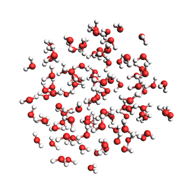

.. code:: ipython3

   print(
       "2-1 water-acetonitrile in a sphere from exact density (in g/cm^3) and "
       "approximate number of atoms and mole fractions"
   )
   out, details = packmol(
       molecules=[water, acetonitrile],
       mole_fractions=[x_water, x_acetonitrile],
       n_atoms=500,
       density=density,
       return_details=True,
       sphere=True,
   )
   printsummary(out, details)
   out.write("water-acetonitrile-sphere.xyz")
   view(out, padding=-3)

::

   2-1 water-acetonitrile in a sphere from exact density (in g/cm^3) and approximate number of atoms and mole fractions
   501 atoms, density = 0.920 g/cm^3, formula = C84H292N42O83
   #added molecules per species: [83, 42], mole fractions: [0.664, 0.336]

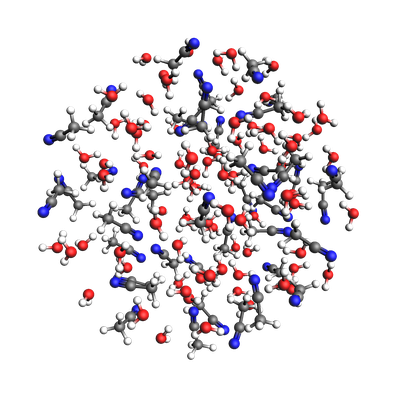

Packing ions, total system charge
~~~~~~~~~~~~~~~~~~~~~~~~~~~~~~~~~

The total system charge will be sum of the charges of the constituent molecules.

In PLAMS, ``molecule.properties.charge`` specifies the charge:

.. code:: ipython3

   ammonium = from_smiles("[NH4+]")  # ammonia.properties.charge == +1
   chloride = from_smiles("[Cl-]")  # chloride.properties.charge == -1
   print("3 water molecules, 3 ammonium, 1 chloride (non-periodic)")
   print("Initial charges:")
   print(f"Water: {water.properties.get('charge', 0)}")
   print(f"Ammonium: {ammonium.properties.get('charge', 0)}")
   print(f"Chloride: {chloride.properties.get('charge', 0)}")
   out = packmol(molecules=[water, ammonium, chloride], n_molecules=[3, 3, 1], density=0.4, sphere=True)
   tot_charge = out.properties.get("charge", 0)
   print(f"Total charge of packmol-generated system: {tot_charge}")
   out.write("water-ammonium-chloride.xyz")
   view(out, fixed_atom_size=False)

::

   3 water molecules, 3 ammonium, 1 chloride (non-periodic)
   Initial charges:
   Water: 0
   Ammonium: 1
   Chloride: -1
   Total charge of packmol-generated system: 2

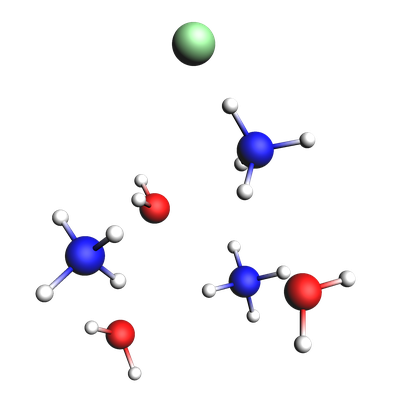

Microsolvation
~~~~~~~~~~~~~~

``packmol_microsolvation`` can create a microsolvation sphere around a solute.

.. code:: ipython3

   from scm.plams import packmol_microsolvation

   out = packmol_microsolvation(solute=acetonitrile, solvent=water, density=1.5, threshold=4.0)
   # for microsolvation it's a good idea to have a higher density than normal to get enough solvent molecules
   print(f"Microsolvated structure: {len(out)} atoms.")
   out.write("acetonitrile-microsolvated.xyz")

   view(out, padding=-2)

::

   Microsolvated structure: 69 atoms.

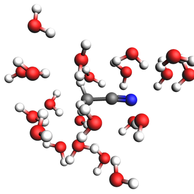

Solid-liquid or solid-gas interfaces
~~~~~~~~~~~~~~~~~~~~~~~~~~~~~~~~~~~~

First, create a slab using the ASE ``fcc111`` function

.. code:: ipython3

   from scm.plams import plot_molecule, fromASE
   from ase.build import fcc111

   slab = fromASE(fcc111("Al", size=(4, 6, 3), vacuum=15.0, orthogonal=True, periodic=True))
   view(slab, fixed_atom_size=False)

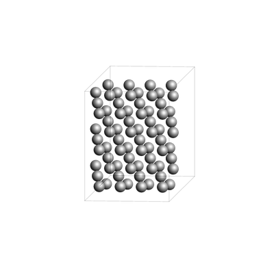

.. code:: ipython3

   print("water surrounding an Al slab, from an approximate density")
   if AMS2025:
       out = packmol_around(slab, water, density=1.0)
       printsummary(out)
       out.write("al-water-pure.xyz")
       img = view(out, width=800, height=600, padding=-2, fixed_atom_size=False, direction="corner_z")
   else:
       img = None
   img

::

   water surrounding an Al slab, from an approximate density
   534 atoms, density = 1.325 g/cm^3, box = 11.455, 14.881, 34.677, formula = Al72H308O154

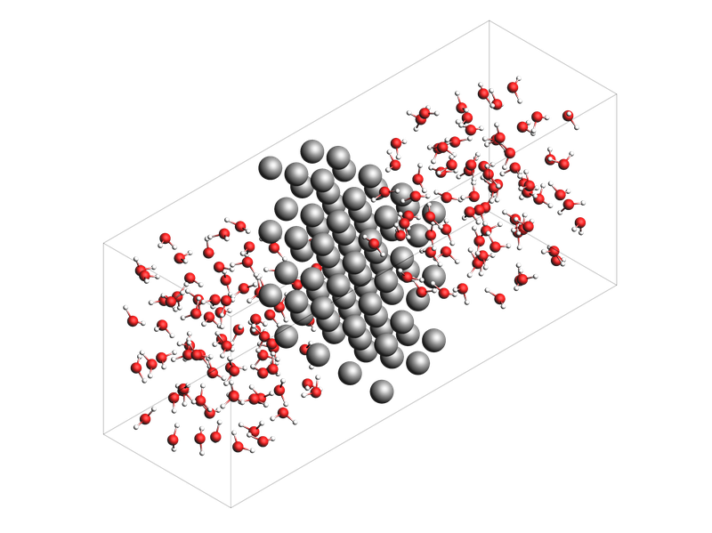

.. code:: ipython3

   print("2-1 water-acetonitrile mixture surrounding an Al slab, from mole fractions and an approximate density")
   if AMS2025:
       out = packmol_around(slab, [water, acetonitrile], mole_fractions=[x_water, x_acetonitrile], density=density)
       printsummary(out)
       out.write("al-water-acetonitrile.xyz")
       img = view(out, width=800, height=600, padding=-2, fixed_atom_size=False, direction="corner_z")
   else:
       img = None
   img

::

   2-1 water-acetonitrile mixture surrounding an Al slab, from mole fractions and an approximate density
   468 atoms, density = 1.260 g/cm^3, box = 11.455, 14.881, 34.677, formula = C66H231Al72N33O66

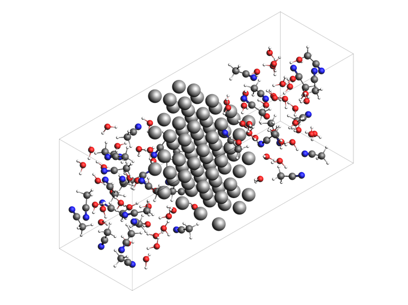

.. code:: ipython3

   from ase.build import surface

   if AMS2025:
       print("water surrounding non-orthorhombic Au(211) slab, from an approximate number of molecules")
       print("NOTE: non-orthorhombic cell, results are approximate, requires AMS2025")
       slab = surface("Au", (2, 1, 1), 6)
       slab.center(vacuum=11.0, axis=2)
       slab.set_pbc(True)
       slab = fromASE(slab)
       out = packmol_around(slab, [water], n_molecules=[32], tolerance=1.8)
       out.write("Au211-water.xyz")
       img = view(out, padding=-3, fixed_atom_size=False, lattice_as_basis=True, direction="corner_x")
       print(f"{out.lattice=}")
   else:
       img = None
   img

::

   water surrounding non-orthorhombic Au(211) slab, from an approximate number of molecules
   NOTE: non-orthorhombic cell, results are approximate, requires AMS2025
   out.lattice=[(9.1231573482, 0.0, 0.0), (3.6492629392999993, 4.4694160692, 0.0), (0.0, 0.0, 31.161091638)]

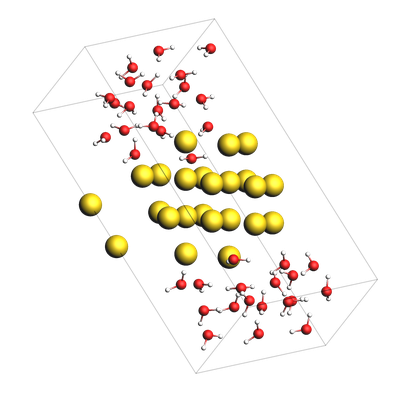

Pack inside voids in crystals
~~~~~~~~~~~~~~~~~~~~~~~~~~~~~

Use the ``packmol_around`` function. You can decrease ``tolerance`` if you need to pack very tightly. The default value for ``tolerance`` is 2.0.

.. code:: ipython3

   from scm.plams import fromASE
   from ase.build import bulk

   bulk_Al = fromASE(bulk("Al", cubic=True).repeat((3, 3, 3)))
   view(bulk_Al, direction="tilt_x")

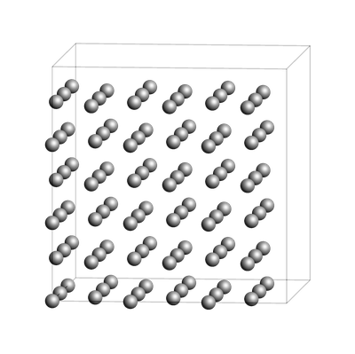

.. code:: ipython3

   if AMS2025:
       out = packmol_around(
           current=bulk_Al,
           molecules=[from_smiles("[H]"), from_smiles("[He]")],
           n_molecules=[50, 20],
           tolerance=1.5,
       )
       img = view(out, direction="tilt_x")
       printsummary(out)
       out.write("al-bulk-with-h-he.xyz")
   else:
       img = None
   img

::

   178 atoms, density = 2.819 g/cm^3, box = 12.150, 12.150, 12.150, formula = Al108H50He20

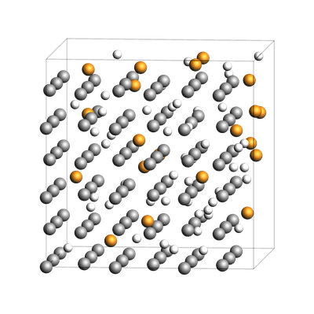

Bonds, atom properties (force field types, regions, …)
~~~~~~~~~~~~~~~~~~~~~~~~~~~~~~~~~~~~~~~~~~~~~~~~~~~~~~

The ``packmol()`` function accepts the arguments ``keep_bonds`` and ``keep_atom_properties``. These options will keep the bonds defined for the constitutent molecules, as well as any atomic properties.

The bonds and atom properties are easiest to see by printing the System block for an AMS job:

.. code:: ipython3

   from scm.plams import Settings

   water = from_smiles("O")
   n2 = from_smiles("N#N")

   # delete properties coming from from_smiles
   for at in water:
       at.properties = Settings()
   for at in n2:
       at.properties = Settings()

   water[1].properties.region = "oxygen_atom"
   water[2].properties.mass = 2.014  # deuterium
   water.delete_bond(water[1, 2])  # delete bond between atoms 1 and 2 (O and H)

.. code:: ipython3

   from scm.plams import AMSJob

   out = packmol([water, n2], n_molecules=[2, 1], density=0.5)
   print(AMSJob(molecule=out).get_input())
   view(out, show_regions=True, show_atom_labels=True)

::

   System
     Atoms
                 O       4.4355960000       3.5642550000       1.8473380000 region=mol0,oxygen_atom
                 H       4.9232100000       4.0858070000       1.1757020000 mass=2.014 region=mol0
                 H       4.9611320000       2.7996470000       2.1688970000 region=mol0
                 O       1.3763300000       4.4142550000       4.2505660000 region=mol0,oxygen_atom
                 H       2.1765270000       4.9176580000       3.9914350000 mass=2.014 region=mol0
                 H       1.5682350000       3.4587250000       4.3703520000 region=mol0
                 N       4.9600640000       4.0193100000       4.5389500000 region=mol1
                 N       4.3638220000       4.9242740000       4.7790670000 region=mol1
     End
     BondOrders
        1 3 1.0
        4 6 1.0
        7 8 3.0
     End
     Lattice
            5.9692549746     0.0000000000     0.0000000000
            0.0000000000     5.9692549746     0.0000000000
            0.0000000000     0.0000000000     5.9692549746
     End
   End

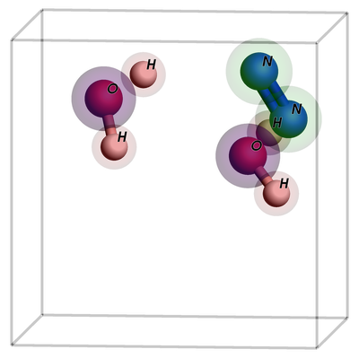

By default, the ``packmol()`` function assigns regions called ``mol0``, ``mol1``, etc. to the different added molecules. The ``region_names`` option lets you set custom names.

.. code:: ipython3

   out = packmol(
       [water, n2],
       n_molecules=[2, 1],
       density=0.5,
       region_names=["water", "nitrogen_molecule"],
   )
   print(AMSJob(molecule=out).get_input())
   view(out, show_regions=True, show_atom_labels=True)

::

   System
     Atoms
                 O       0.9412850000       4.8929630000       4.1846560000 region=oxygen_atom,water
                 H       1.0428090000       4.8446930000       3.2108790000 mass=2.014 region=water
                 H       1.4100170000       4.1588480000       4.6380650000 region=water
                 O       2.2858720000       4.4457800000       1.4446890000 region=oxygen_atom,water
                 H       1.4075720000       4.0130320000       1.3978160000 mass=2.014 region=water
                 H       2.9185420000       3.9309220000       1.9913750000 region=water
                 N       5.0059230000       0.9480720000       1.0672730000 region=nitrogen_molecule
                 N       4.0199840000       1.0610560000       1.5645440000 region=nitrogen_molecule
     End
     BondOrders
        1 3 1.0
        4 6 1.0
        7 8 3.0
     End
     Lattice
            5.9692549746     0.0000000000     0.0000000000
            0.0000000000     5.9692549746     0.0000000000
            0.0000000000     0.0000000000     5.9692549746
     End
   End

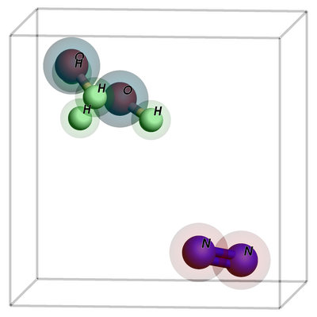

Below, we also set ``keep_atom_properties=False``, this will remove the previous regions (in this example “oxygen_atom”) and mass.

.. code:: ipython3

   out = packmol([water, n2], n_molecules=[2, 1], density=0.5, keep_atom_properties=False)
   print(AMSJob(molecule=out).get_input())
   view(out, show_regions=True, show_atom_labels=True)

::

   System
     Atoms
                 O       4.1330940000       3.7886780000       2.3494640000 region=mol0
                 H       3.9092850000       3.3428270000       3.1932680000 region=mol0
                 H       4.8740760000       3.3419770000       1.8851170000 region=mol0
                 O       3.7890770000       1.3436200000       4.8265030000 region=mol0
                 H       4.7553540000       1.5070820000       4.8048720000 region=mol0
                 H       3.2805450000       2.1736560000       4.9555440000 region=mol0
                 N       1.0131250000       1.9953560000       4.2799880000 region=mol1
                 N       1.4602220000       1.0104670000       4.5294220000 region=mol1
     End
     BondOrders
        1 3 1.0
        4 6 1.0
        7 8 3.0
     End
     Lattice
            5.9692549746     0.0000000000     0.0000000000
            0.0000000000     5.9692549746     0.0000000000
            0.0000000000     0.0000000000     5.9692549746
     End
   End

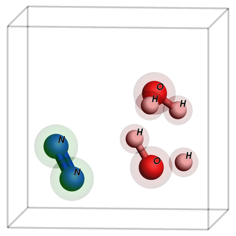

``keep_bonds=False`` will additionally ignore any defined bonds:

.. code:: ipython3

   out = packmol(
       [water, n2],
       n_molecules=[2, 1],
       density=0.5,
       region_names=["water", "nitrogen_molecule"],
       keep_bonds=False,
       keep_atom_properties=False,
   )
   print(AMSJob(molecule=out).get_input())
   view(out, show_regions=True, show_atom_labels=True)

::

   System
     Atoms
                 O       2.2192020000       3.2350510000       1.4164100000 region=water
                 H       1.9791790000       2.2849450000       1.4402100000 region=water
                 H       3.1837230000       3.3717970000       1.5397620000 region=water
                 O       1.4989270000       3.3843820000       4.5151270000 region=water
                 H       1.4682870000       2.5098660000       4.9568980000 region=water
                 H       1.7146230000       3.3045200000       3.5605000000 region=water
                 N       4.9654310000       4.6289950000       4.0530910000 region=nitrogen_molecule
                 N       4.2479540000       4.9643780000       4.8308210000 region=nitrogen_molecule
     End
     Lattice
            5.9692549746     0.0000000000     0.0000000000
            0.0000000000     5.9692549746     0.0000000000
            0.0000000000     0.0000000000     5.9692549746
     End
   End

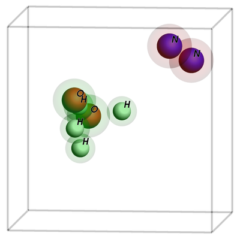
