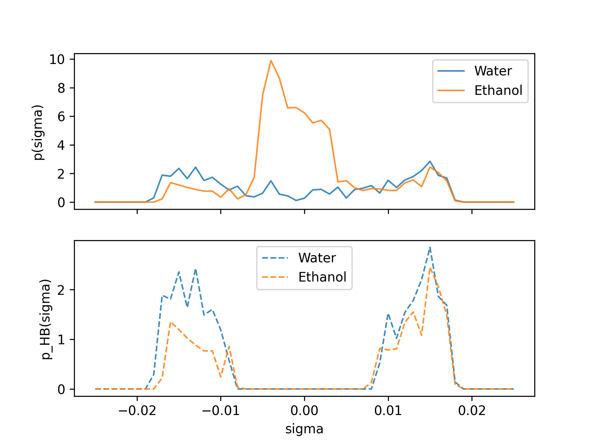

COSMO-RS
--------

.. currentmodule:: scm.plams.interfaces.adfsuite.crs

COSMO-RS can be run from PLAMS using the |CRSJob| class and the corresponding |CRSResults|,
both respectively being subclasses of |SCMJob| and |SCMResults|.

.. note:: There is also `a tutorial showing full code examples <../../COSMO-RS/PLAMS_COSMO-RS_scripting.html>`__ available in the COSMO-RS documentation.  There are several templates available that can easily be customized for other problem types, workflows, etc.

Settings
~~~~~~~~

A COSMO-RS job is configured through the PLAMS |Settings| object. For most
workflows, use :meth:`CRSJob.input_builder` to create these settings. The input
builder provides a property-specific interface and converts the builder state to
|Settings| with ``to_settings()`` or directly to a :class:`CRSJob` with
``to_job()``.

For advanced workflows, you can also construct or modify |Settings| manually
with helper methods such as :meth:`CRSJob.compound_block` and
:meth:`CRSJob.method_block`.

Input builders
^^^^^^^^^^^^^^

The recommended way to prepare COSMO-RS input from PLAMS is
:meth:`CRSJob.input_builder`. This method returns a property-specific input
builder. The builder exposes the input keys, compound roles, and calculation
modes supported by the selected property type.

For example, the following COSMO-RS input performs a pure sigma-profile
calculation:

.. code-block:: none

    compound /path/to/file.coskf
        frac1 1.0
    end

    property puresigmaprofile
        nprofile 50
        sigmamax 0.025
    end

The same input can be prepared with :meth:`CRSJob.input_builder`:

.. code-block:: python

    from scm.plams import CRSJob

    builder = CRSJob.input_builder("PURESIGMAPROFILE")
    builder.nprofile = 50
    builder.sigmamax = 0.025
    builder.add_compound(CRSJob.coskf_from_database("Water.coskf"))

    job = builder.to_job()
    results = job.run()

Use :meth:`CRSInputBuilder.describe` to inspect the input keys accepted by a
builder:

.. code-block:: python

    for line in builder.describe(include_values=True):
        print(line)

Some property types support calculation modes. For example, solubility can be
set up for a gas-phase solute using ``mode="gas"``:

.. code-block:: python

    builder = CRSJob.input_builder("SOLUBILITY", mode="gas", temperature=298.15)
    builder.add_solvent(CRSJob.coskf_from_database("Water.coskf"), frac1=1.0)
    builder.add_solute(CRSJob.coskf_from_database("Benzene.coskf"))

    settings = builder.to_settings()

Settings with multiple compounds
~~~~~~~~~~~~~~~~~~~~~~~~~~~~~~~~

Many COSMO-RS property types require more than one compound. With
:meth:`CRSJob.input_builder`, compounds are added with the role-specific methods
supported by the selected property type. The builder checks that compounds are
added with roles and counts supported by that property type.

For mixture properties, use ``add_compound()``:

.. code-block:: python

    from scm.plams import CRSJob

    builder = CRSJob.input_builder("TERNARYMIX", temperature=298.15)

    builder.add_compound(CRSJob.coskf_from_database("Water.coskf"), frac1=0.33)
    builder.add_compound(CRSJob.coskf_from_database("Ethanol.coskf"), frac1=0.33)
    builder.add_compound(CRSJob.coskf_from_database("Benzene.coskf"), frac1=0.34)

    job = builder.to_job()
    results = job.run()

For solvent and solute roles, use ``add_solvent()`` and ``add_solute()``:

.. code-block:: python

    builder = CRSJob.input_builder("SOLUBILITY", temperature=298.15)
    builder.add_solvent(CRSJob.coskf_from_database("Water.coskf"), frac1=1.0)
    builder.add_solute(
        CRSJob.coskf_from_database("Benzene.coskf"),
        meltingpoint=278.7,
        hfusion=2.37,
    )

    settings = builder.to_settings()

Lower-level Settings helpers
^^^^^^^^^^^^^^^^^^^^^^^^^^^^

For advanced workflows, you can combine the input builder with lower-level
|Settings| helpers. Use ``builder.to_settings(include_compounds=False)`` to
create the top-level and ``property`` input without adding the builder's
compound blocks. You can then assign ``settings.input.compound`` manually from
a list of :meth:`CRSJob.compound_block` objects, and add method parameters with
:meth:`CRSJob.method_block`.

.. code-block:: python

    from scm.plams import CRSJob

    builder = CRSJob.input_builder(
        "SOLUBILITY",
        temperature="273.15 283.15 10",
        mode="solid",
    )

    settings = builder.to_settings(include_compounds=False)
    settings += CRSJob.method_block("COSMOSAC2013", include_defaults=True)
    settings.input.compound = [
        CRSJob.compound_block(CRSJob.coskf_from_database("Water.coskf"), frac1=1.0),
        CRSJob.compound_block(
            CRSJob.coskf_from_database("Benzene.coskf"),
            meltingpoint=278.7,
            hfusion=2.37,
        ),
    ]

    job = CRSJob(settings=settings)
    results = job.run()

The supported property types and methods can be inspected from Python:

.. code-block:: python

    CRSJob.property_types()
    CRSJob.property_type_metadata("SOLUBILITY", as_summary=True)
    CRSJob.methods()

ADF and CRSJob
~~~~~~~~~~~~~~

A workflow is presented in the `ADF and COSMO-RS workflow Python example <../../PythonExamples/ams-crs-workflow/index.html>`__.
In this workflow, we follow the usual procedure of generating the inputs required to run COSMO-RS and COSMO-SAC calculations.

.. _parameters: ../../COSMO-RS/COSMO-RS_and_COSMO-SAC_parameters.html

Data analysis and plotting
~~~~~~~~~~~~~~~~~~~~~~~~~~

The :class:`CRSResults` class provides table-based helpers for analyzing and
plotting COSMO-RS results. The recommended entry point is
:meth:`CRSResults.get_result_table`, which returns a `Pandas DataFrame` with
one row per component, mixture, or sigma-grid point, depending on the property.

For example, a pure sigma-profile calculation can be converted to a table and
plotted directly:

.. code-block:: python

    from scm.plams import CRSJob, CRSResults

    builder = CRSJob.input_builder("PURESIGMAPROFILE")
    builder.nprofile = 50
    builder.sigmamax = 0.025
    builder.add_compound(CRSJob.coskf_from_database("Water.coskf"))
    builder.add_compound(CRSJob.coskf_from_database("Ethanol.coskf"))

    results = builder.to_job().run()

    table = results.get_result_table(quantities="default", column_labels="symbol")
    fig = CRSResults.plot_sigma_profile_table(
        table,
        y=("profile", "hbprofile"),
        split=True,
    )
    fig.savefig("sigma_profile_demo.png", dpi=300)

For LLE-style calculations such as :code:`LLE` and :code:`STABILITY`, result
tables from multiple jobs can be combined before plotting.

.. code-block:: python

    from scm.plams import CRSJob, CRSResults

    tables = []

    for x3 in (0.1, 0.2, 0.3, 0.4, 0.5, 0.6, 0.7, 0.8, 0.9):
        builder = CRSJob.input_builder("LLE", method="COSMO-RS", temperature=298.15)
        x = (1.0 - x3) / 2.0
        builder.add_compound(CRSJob.coskf_from_database("Water.coskf"), frac1=x)
        builder.add_compound(CRSJob.coskf_from_database("Ethyl_acetate.coskf"), frac1=x)
        builder.add_compound(CRSJob.coskf_from_database("Benzene.coskf"), frac1=x3)

        results = builder.to_job().run()
        tables.append(results.get_result_table())

    combined = CRSResults.combine_result_tables(tables)
    fig = CRSResults.plot_lle_phase_diagram(combined, plot_feed=True, plot_phase_boundaries=True, plot_tielines=True)
    fig.savefig("lle_demo.png", dpi=300)

For new scripts, prefer :meth:`CRSResults.get_result_table`. The lower-level
helpers below remain available for direct access to specific arrays or scalar
values.

============================ =======================================
Quantity                     Lower-level helper
============================ =======================================
Sigma profile arrays         :meth:`CRSResults.get_sigma_profile`
Sigma potential arrays       :meth:`CRSResults.get_sigma_potential`
Activity coefficient scalar  :meth:`CRSResults.get_activity_coefficient`
Solvation energy scalar      :meth:`CRSResults.get_energy`
Raw section data             :meth:`CRSResults.get_results`
============================ =======================================

API
~~~

.. autoclass:: CRSJob
    :no-private-members:
    :no-special-members:
    :exclude-members: input_builder

    .. py:staticmethod:: CRSJob.input_builder(property_type, *, method="COSMO-RS", mode=None, use_defaults=False, **kwargs)

        Return a property-specific CRS input builder.

        The ``property_type`` argument selects the builder class. The returned
        builder validates the keys, modes, and compound roles supported by that
        property type.

.. autoclass:: CRSResults
    :members:
        get_result_table,
        get_result_table_metadata,
        combine_result_tables,
        plot_sigma_profile_table,
        plot_lle_phase_diagram,
        get_multispecies_dist,
        get_structure_energy,
        get_activity_coefficient,
        get_energy,
        get_sigma_profile,
        get_sigma_potential,
        get_results,
        get_prop_names,
        plot
    :no-private-members:
    :no-special-members:

.. autoclass:: CRSInputBuilder
    :no-private-members:
    :no-special-members:
